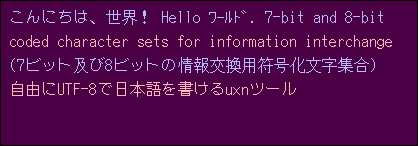

# uxn-ja

This is a tool for helping make [uxn](https://wiki.xxiivv.com/site/uxn.html) applications containing Japanese text.



## Usage

Run `python3 uxnja-make.py YOUR_CODE.tal fonts/milkjf_8x16r.bdf fonts/milkjf_k16.bdf`. You can try some of the other files in `fonts/` too.

* If you want to see an example, supply `test.tal` as `YOUR_CODE.tal`.

Now in `YOUR_CODE.tal`, you can use `uxnja-draw` from `uxnja.tal` which relies on `uxnja-font.tal`.

```tal
~uxnja.tal

|0100
    ( text    x     y     color )
    ;yorosiku #0008 #0008 #41
    ;uxnja-draw JSR2
    BRK

@yorosiku
    "よろしくお願いします！
```

The "color" byte is the one sent to `.Screen/pixel`, so `#41` means [1-on-0 on the foreground layer](https://wiki.xxiivv.com/site/varvara.html#screen).

## How it works

The Python script brute-forces a [perfect hash function](https://en.wikipedia.org/wiki/Perfect_hash_function) `f(x) = x mod M₁ mod M₂` where `x` ranges over character codes used in string tokens in `YOUR_CODE.tal` and `M₂` is as small as possible.

It writes font data, a look-up table, M₁ and M₂ to `uxnja-font.tal`, which is imported by `uxnja.tal`.

Now when you call `uxnja-draw`, it loops over UTF-8 units `x` in the given string, and draws the sprite at `font[lut[x mod M₁ mod M₂]]` for each of them.

## Why?

A 16×16 Japanese bitmap font with kanji support is at least 200 kB, which is far over the maximum uxn ROM size of 64 kB.

By only bundling the characters used in the ROM and accessing them with a hash function, we can get workable Japanese fonts in uxn that are only 4 kB or so. Each kanji used costs 32 bytes.

## Font credits

The fonts directory contains fonts from [milkjf](http://uobikiemukot.github.io/milkjf/), [jiskan](https://ja.wikipedia.org/wiki/Jiskan), and Sony's [8x16rk.bdf](https://github.com/freedesktop/xorg-font-sony-misc/blob/master/8x16rk.bdf).
